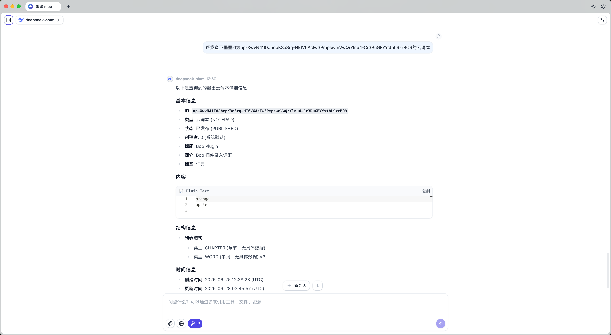

# Maimemo MCP Server

[](https://golang.org)
[](https://opensource.org/licenses/MIT)
[](https://goreportcard.com/report/github.com/A11Might/mcp-server-maimemo)

Maimemo MCP Server 是一个基于 [墨墨背单词](https://open.maimemo.com) API 构建的 [MCP(Model Context Protocol)](https://modelcontextprotocol.io/introduction) 服务端。它允许用户通过 MCP 协议与墨墨背单词进行交互，例如查询单词、获取云词本等。

## 🛠️ Tools

* `greet`: 一个简单的问候工具，用于测试服务是否正常运行。
* `get_notepad`: 根据提供的云词本 ID 获取指定的墨墨云词本。

## 🖼️ Preview



## 🚀 Usage

> 打开墨墨背单词 App，在「我的 > 更多设置 > 实验功能 > 开放 API」申请并复制 Token

1. 克隆项目到本地：

    ```bash
    git clone https://github.com/A11Might/mcp-server-maimemo.git
    cd mcp-server-maimemo
    ```

2. 构建服务：

    ```bash
    go mod tidy
    go build -o mcp-server-maimemo
    ```

3. 配置:

    ```json
    {
        "mcpServers": {
            "mcp-server-maimemo": {
                "command": "/path/to/your/hello-server/mcp-server-maimemo",
                "env": {
                    "MAIMEMO_TOKEN": "your_maimemo_token"
                }
            }
        }
    }
    ```

## 🤝 贡献

欢迎任何形式的贡献！如果你有任何想法或建议，请随时提出 Issue 或 Pull Request。

## 📄 许可证

本项目基于 [MIT License](https://opensource.org/licenses/MIT) 开源。
