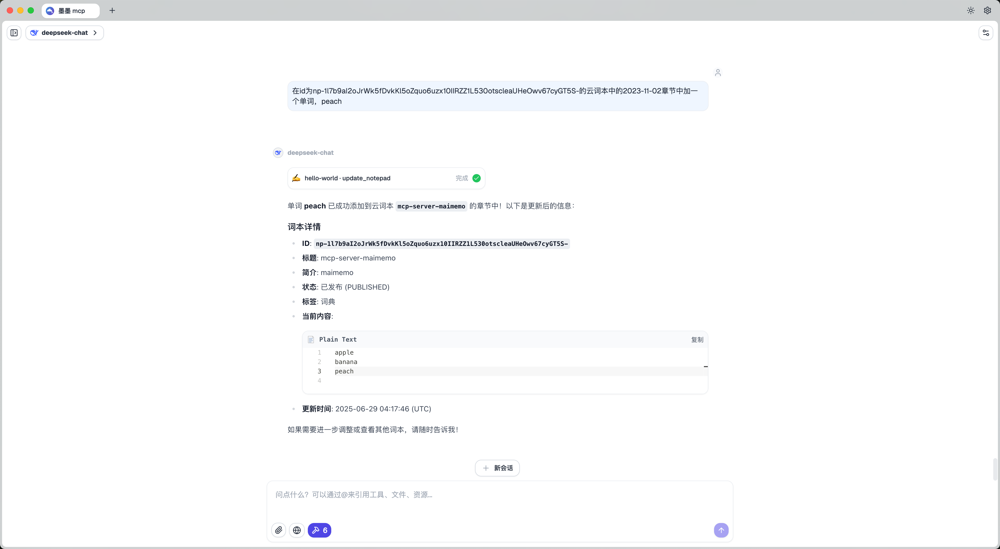

# Maimemo MCP Server

[](https://golang.org)
[](https://opensource.org/licenses/MIT)
[](https://goreportcard.com/report/github.com/A11Might/mcp-server-maimemo)

Maimemo MCP Server 是一个基于 [墨墨背单词](https://open.maimemo.com) API 构建的 [MCP(Model Context Protocol)](https://modelcontextprotocol.io/introduction) 服务端。它允许用户通过 MCP 协议与墨墨背单词进行交互，例如查询单词、获取云词本等。

## 🛠️ Tools

### 释义 (Interpretations)

* `list_interpretations`: 获取释义
* `create_interpretation`: 创建释义
* `update_interpretation`: 更新释义
* `delete_interpretation`: 删除释义

### 助记 (Notes)

* `list_notes`: 获取助记
* `create_note`: 创建助记
* `update_note`: 更新助记
* `delete_note`: 删除助记

### 云词本 (Notepads)

* `list_notepads`: 查询云词本
* `create_notepad`: 创建云词本
* `get_notepad`: 获取云词本
* `update_notepad`: 更新云词本
* `delete_notepad`: 删除云词本

### 例句 (Phrases)

* `list_phrases`: 获取例句
* `create_phrase`: 创建例句
* `update_phrase`: 更新例句
* `delete_phrase`: 删除例句

### 单词 (Vocabularies)

* `get_vocabulary`: 查询单词

## 🖼️ Preview



## 🚀 Usage

> 打开墨墨背单词 App，在「我的 > 更多设置 > 实验功能 > 开放 API」申请并复制 Token

1. 安装

    使用 go install 安装：

    ```go
    go install github.com/A11Might/mcp-server-maimemo@latest
    ```

3. 使用

    将服务集成到支持 MCP 的 APP 中：

    ```json
    {
        "mcpServers": {
            "mcp-server-maimemo": {
                "command": "mcp-server-maimemo",
                "env": {
                    "MAIMEMO_TOKEN": "your_maimemo_token"
                }
            }
        }
    }
    ```

## 🤝 贡献

欢迎任何形式的贡献！如果你有任何想法或建议，请随时提出 Issue 或 Pull Request。

## 📄 许可证

本项目基于 [MIT License](https://opensource.org/licenses/MIT) 开源。
